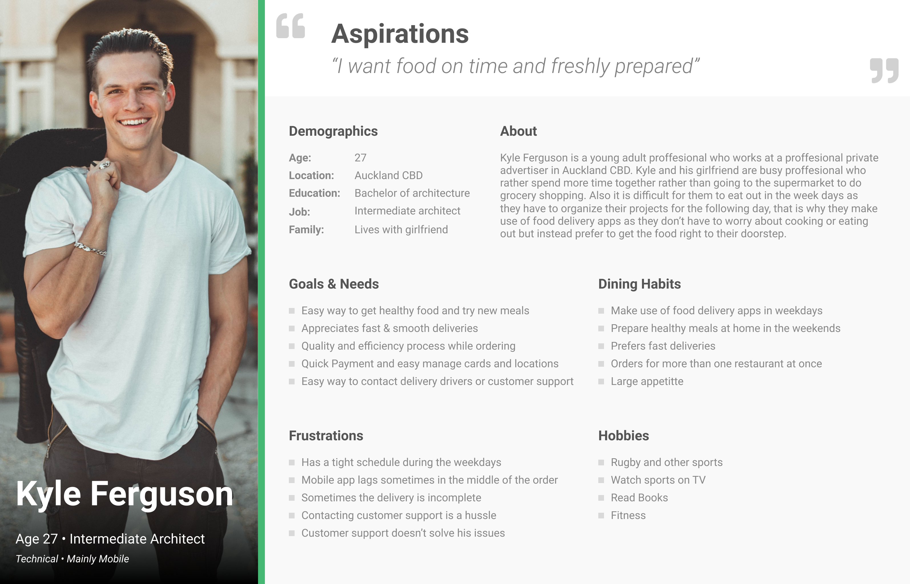
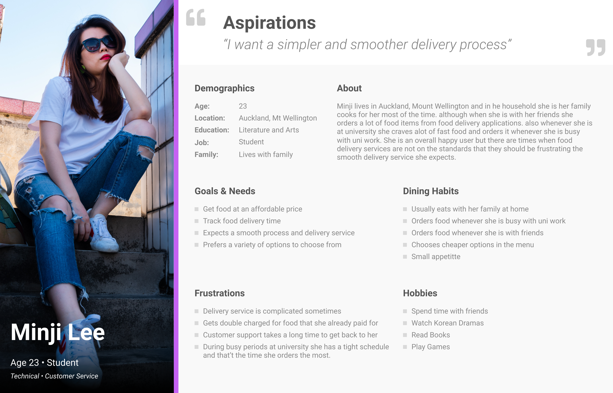

* * *

# Improving Food Delivery Processes in New Zealand with Libera

* * *

## Introduction 

There are many problems involving food delivery apps like uber eats or menulog. Even though they do a good job at delivering food to our door, there are still some processes that can be simplified for entry level users and long term users. Some consequences for these processes can cause unnecessary hassles for users.

My Intention with this project is to get a deeper understanding behind the systems in order to provide better processes that can help users and increase the ease of use of food delivery apps while building my own food delivery app design, libera.

When diving into the project I gained a deep understanding of how users interact with apps and are faced with lots of emotions and thoughts when ordering food specifically which can decide the outcome of the ordering & delivery process. This information was then used to implement a simple and smooth process for users to be less stressed out when ordering by guiding their process to through  digestible screens to improve their experience.

## Challenge

> Analyze and Design a mobile product to improve many of the current processes as well as solve current problems that users go through when ordering food as well as improving the engagement for a successful order, avoiding users to abandon their current order due to a difficult interaction within the app. 

Food delivery is a huge thing in this busy age and facilitating users with a smooth process will make users more prompt to come back to the app.

## Timeframe
    10 Weeks

## My Role
    UX/UI Design

This project was part of my ui and ux design class where I did the whole project on my own while iterating on the solutions with teachers feedback and others students point of view.

## Research

### Users & Audience

While analyzing the audience, I came to the conclusion that in this area users vary from different age ranges. Most users are people with busy itineraries that need food to be delivered fast or people that want to escape the routines of cooking the meals at home to get some food quickly. The common users just need less time worrying about what they cook or eat so they rather have something delivered to their door.

Users' personas bring a more deep explanation of what are the common users for our product.

 

### Customer Journey Map

In order to understand the users the journey map facilitated all the different details and behaviors the users go through and this will help us analyze the users in a more detailed way in order to provide a more practical approach during the design process.

 

### Data Analysis findings

To evaluate the data I relied on User Interviews, Surveys and Current App usage metrics in order to understand users decisions when interacting with current apps in the market. These allowed me to visualize what are some of the already well implemented parts of a delivery service and pain points that users encounter. Below we can find a list of pain points that users encounter based on the data gathered.

4 users were interviewed in a face to face manner and 25 people were sent a survey in order to find the necessary information. Some of the questions that were asked through the surveys and user interviews are the following.

- Do you feel comfortable using delivery apps?

- What makes you order food through delivery apps?

- What do you struggle with most when ordering food?

- What are some of the factors that influence your decision when it comes to ordering food through delivery services?

- What aspects of food delivery services are most important to you?

| Problem      | Potential Solution |
| -----------  | -----------        |
| **Expected delivery time order:** Some users want to know the estimated delivery time before ordering to check in if it will fit into their current available time. | This problem has could be solved by adding a label with the estimated time for the delivery, in order to provide users the context. |  
| **Familiarity and Recommendations:** Users want to try new types of food but are hesitant to do so in order to avoid a bad experience or food that they won’t like. This is a really complex problem for users because there are multiple ways we can recommend the best options for them but seeing other users' experience prompt them to be more likely to either order or not order. | After analyzing what is a simple way we could interest and user to try a new restaurant a label was added with the restaurant rating and other users reviews. This encourages users to try other recommended options based on others' experiences and restaurant rating. |
| **Order options are confusing at times:** Users want to try new types of food but are hesitant to do so in order to avoid a bad experience or food that they won’t like. | This could be improved by implementing section separations and clear selection checkboxes. |

## User Flow

The user flow captures the essence for the app flow and this will, later on, help us to create the nessesary wireframes and final design which will improve the overall experience. These are the main steps for the user flow.

## Wireframes

The wireframes outline the initial design of the app and follow the process of the user flow previously created, in the project I used the wireframes to layout the content and functionality on each of the screens that will be needed for the app. The initial process starts with the login of the application and divides into many more features like registration, checkout, tracking order, and rating delivery drivers. This helped me visualize the main features and the fixes I wanted to implement from the users research.

## Final Design

## Outcomes & Lessons

The research part of this project has allowed me to see what customers are complaining about and understanding the end-user. There will be things that'll need improvement, but through iteration there are going to be features that could be implemented in some other different way or that could be slightly changed. However the mission is to keep gaining knowledge of how users interact with the app and apply those findings. Through testing and iteration we can see what works and what doesn’t while applying good affordances, signifiers, constraints, feedback, mappings and a conceptual model to facilitate users an amazing experience.

